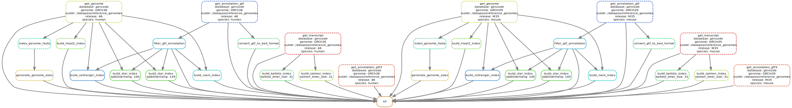

# 📚 Snakemake pipeline: genome-reference-builder

This README provides detailed instructions for using the **Genome Reference Builder**, a Snakemake pipeline that automates the process of genome indexing for organisms such as human and mouse. It integrates tools like `STAR`, `RSEM`, and `Cell Ranger`, streamlining the genome preparation process for downstream analysis.

## 🌟 Introduction

The Genome Reference Builder pipeline simplifies and automates the creation of genome indices, which are essential for various genomic analyses. This pipeline integrates multiple bioinformatics tools to ensure a smooth and efficient genome indexing process. The pipeline is built around GENCODE annotation data and is currently set to use May 2024 versions:

- Human: GENCODE Release 46 (GRCh38.p14)
- Mouse: GENCODE Release M35 (GRCm39)

**⚠️ Note:** These versions will be used for the foreseeable future in all my personal analyses.

## 🔄 Pipeline overview



The following flowchart shows the main steps of the **Genome Reference Builder** pipeline and their interrelationships:

1. **Download reference data**: Fetch the latest GENCODE annotation and genome sequence files.
2. **Filter GTF files**: Apply filtering criteria to GTF files to retain only relevant gene and transcript types.
3. **Generate genome indices**: Create genome indices using various bioinformatics tools such as `STAR`, `HISAT2`, `Kallisto`, `Salmon`, `RSEM`, and `Cell Ranger`.
4. **Validate outputs**: Ensure the generated indices are correct and consistent with the input data.

Each step is interconnected, ensuring a streamlined and automated process for preparing genome references.

## 📋 Prerequisites

Before running the pipeline, ensure that you have installed the following prerequisites:

- Mamba (Mamba or Micromamba distribution)
- Snakemake (version 8.3.2 or higher)

Additionally, the pipeline relies on specific versions of bioinformatics software:

| **Software**   | **Version** | **Reference (PMID)** |
|----------------|-------------|----------------------|
| **HISAT2**     | 2.2.1       | [31375807](https://pubmed.ncbi.nlm.nih.gov/31375807) |
| **STAR**       | 2.7.11b     | [23104886](https://pubmed.ncbi.nlm.nih.gov/23104886) |
| **Kallisto**   | 0.51.0      | [27043002](https://pubmed.ncbi.nlm.nih.gov/27043002) |
| **Salmon**     | 1.10.1      | [28263959](https://pubmed.ncbi.nlm.nih.gov/28263959) |
| **RSEM**       | 1.3.3       | [21816040](https://pubmed.ncbi.nlm.nih.gov/21816040) |
| **Cell Ranger**| 8.0.1       | [28091601](https://pubmed.ncbi.nlm.nih.gov/28091601) |

**⚠️ Note:** To ensure consistency between Bulk RNA-seq and Single-cell RNA-seq data analyses, the genome indexes constructed by this pipeline are based on filtered GTF files following the 10x Genomics filtering scheme. When building the reference genome, the following software utilize the filtered GTF files as input: `RSEM`, `STAR`, and `Cell Ranger`.

The Genome Reference Builder pipeline filters GTF files based on specific gene types and transcript tags to ensure high-quality annotations. Below are the detailed criteria used during the filtering process:

| **Category**          | **Criteria**                                                                                       | **Description**                                              |
|-----------------------|-----------------------------------------------------------------------------------------------------|--------------------------------------------------------------|
| **Gene Types**       | `protein_coding`, `protein_coding_LoF`, `lncRNA`, `IG_C_gene`, `IG_D_gene`, `IG_J_gene`, `IG_LV_gene`, `IG_V_gene`, `IG_V_pseudogene`, `IG_J_pseudogene`, `IG_C_pseudogene`, `TR_C_gene`, `TR_D_gene`, `TR_J_gene`, `TR_V_gene`, `TR_V_pseudogene`, `TR_J_pseudogene` | Only genes belonging to these types are retained.           |
| **Transcript Types** | `protein_coding`, `protein_coding_LoF`, `lncRNA`, `IG_C_gene`, `IG_D_gene`, `IG_J_gene`, `IG_LV_gene`, `IG_V_gene`, `IG_V_pseudogene`, `IG_J_pseudogene`, `IG_C_pseudogene`, `TR_C_gene`, `TR_D_gene`, `TR_J_gene`, `TR_V_gene`, `TR_V_pseudogene`, `TR_J_pseudogene` | Only transcripts of these types are retained.               |
| **Excluded Tags**    | `readthrough_transcript`                                                                            | Transcripts tagged as readthrough are excluded.             |
| **Version Suffix**   | Removed from `gene_id`, `transcript_id`, and `exon_id`                                                | Ensures consistency by removing version numbers from IDs.    |

To evaluate the effectiveness of the filtering process, we present a summary of gene counts before and after filtering for both human and mouse GTF files (May 2024 version).

- Human

    | **GTF**    | **Total** | **Protein-coding** | **lncRNA** |
    |--------------|-----------------|--------------------------|------------------|
    | **Unfiltered** | 61,510          | 20,060                   | 19,230           |
    | **Filtered**   | 39,014          | 19,422                   | 18,948           |

- Mouse

    | **GTF**    | **Total** | **Protein-coding** | **lncRNA** |
    |--------------|-----------------|--------------------------|------------------|
    | **Unfiltered** | 56,951          | 21,677                   | 11,878          |
    | **Filtered**   | 33,968          | 21,479                  | 11,794           |

## 🛠️ Installation

1. Install Snakemake using [Mamba](https://mamba.readthedocs.io) 🐍:
   ```bash
   mamba install -c bioconda snakemake
   ```
2. Clone the pipeline repository from GitLab 🐙:
   ```bash
   git clone git@github.com:catplot/genome-reference-builder.git
   ```
3. Navigate to the pipeline directory 📂:
   ```bash
   cd genome-reference-builder
   ```

## ⚙️ Configuration

The pipeline uses a configuration file (`config.yaml`) to specify the reference genomes and indexing tools. This file is included in the repository and is already set up for the **May 2024 GENCODE versions** of human and mouse genomes. No further modifications to the configuration are required unless you want to adjust specific paths or parameters.

## 🚀 Usage

There are two ways to run the **Genome Reference Builder** pipeline: directly or via a SLURM job scheduler.

### Option 1: Direct execution

You can directly execute the pipeline using the following command:

```bash
snakemake \
    --configfile config/config.yaml \
    --cores 16 \
    --use-conda \
    --rerun-incomplete \
    --keep-going
```

### Option 2: Using SLURM Job Scheduler

To run the pipeline on a SLURM cluster, use the following command to submit jobs to SLURM:

```bash
snakemake \
    --configfile config/config.yaml \
    --cores 16 \
    --use-conda \
    --rerun-incomplete \
    --keep-going \
    --cluster "sbatch --job-name=genome-indexing --mem={resources.mem_mb} --cpus-per-task={threads} --time={resources.runtime} --output=logs/snakemake_%j.out --error=logs/snakemake_%j.err" \
    --jobs 10
```

## 📂 Output

The pipeline generates indexed genome files essential for downstream genomic analysis. The output files are organized in the directory specified in the configuration file, following this structure:

```plaintext
/datapool/reference_genomes/
└── gencode/
    ├── human/
    │   └── 46/
    │       ├── GRCh38.primary_assembly.genome.fa
    │       ├── GRCh38.primary_assembly.genome.fa.fai
    │       ├── GRCh38.v46.transcripts.fa
    │       ├── GRCh38.v46.primary_assembly.annotation.gtf
    │       ├── index/
    │       │   ├── star/
    │       │   ├── hisat2/
    │       │   ├── kallisto/
    │       │   ├── salmon/
    │       │   ├── rsem/
    │       │   └── cellranger/
    └── mouse/
        └── M35/
            ├── GRCm39.primary_assembly.genome.fa
            ├── GRCm39.primary_assembly.genome.fa.fai
            ├── GRCm39.vM35.transcripts.fa
            ├── GRCm39.vM35.primary_assembly.annotation.gtf
            ├── index/
            │   ├── star/
            │   ├── hisat2/
            │   ├── kallisto/
            │   ├── salmon/
            │   ├── rsem/
            │   └── cellranger/
```

## 🐛 Troubleshooting

- Ensure all dependencies are installed correctly and the paths in your config file are properly set.
- For issues related to Snakemake execution, refer to the [Snakemake documentation](https://snakemake.readthedocs.io/) 📖.

## 📞 Further help

For more details or help with specific tools, consult the documentation for each bioinformatics tool used in this pipeline. You can also open an issue on the repository's GitHub page for additional assistance.
